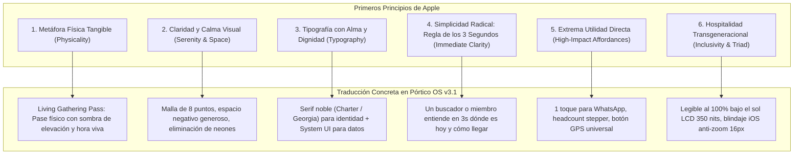

# 🍎 Auditoría de Estética, Belleza y Ergonomía Grado Apple para Pórtico OS v3.1
### *Inspirado en los Primeros Principios de Apple, la Calma de SMAT y la Dignidad Eclesial de Hechos 2*

```yaml
version: 3.1.2-apple-ergonomics-refined
document_id: PORTICO-07-APPLE-ERGONOMICS
date: 2026-09-25
status: RATIFIED_POST_IMPLEMENTATION_CANONICAL
author: Laboratorio Central de Investigación Soberana (`research`) + Human Interface Architecture
brother_documents:
  - 00-Indice.md (Índice y Axiomas Canónicos)
  - 01-portico-producto-mvp-v3.0.md (PRD de Producto y Superficies)
  - 02-portico-autorizacion-identidad-privacidad-mvp-v3.0.md (Contrato de Seguridad y LFPDPPP)
  - 03-portico-piloto-implementacion-mvp-v3.0.md (Arquitectura y Stack Técnico)
  - 04-portico-plan-accion-checklist-mvp-v3.1.md (Checklist Maestro de Ejecución)
  - 05-portico-primeros-principios-literatura-v3.1.md (Tratado de Primeros Principios Eclesiales)
  - 06-portico-gap-analysis-ux-research-v3.1.md (Análisis Forense de Gaps UI/UX Ciclo 2)
  - 08-portico-plan-accion-checklist-ergonomia-triada-v3.1.md (Checklist Implementado al 100%)
canonical_benchmarks:
  - DOSSIER_058 (Calma Visual de Grado Apple en SMAT Minerals)
  - DOSSIER_065 (Ergonomía Transcultural y Tipografía Editorial en Ekovoz)
  - DOSSIER_066 (Benchmarks Universo GitHub para Pórtico OS v3.1)
  - GOLD-138 (Plantilla de Impresión Limpia Folio Pastoral @media print)
  - GOLD-176 / GOLD-060 (Metáfora de Hoja Física, Oclusión Inset y Calma Ergonómica)
  - GOLD-192 (Dual Channel Dispatch WhatsApp Directo)
  - GOLD-193 (Conmutador Dinámico de Contraste Solar Luz de Atrio / Noche de Vigilia)
  - GOLD-199 (Service Worker Network-First con Detección Offline)
  - GOLD-206 (Radar Pastoral y Alertas Jetro 1:10 con Micro-RSVP de Asistencia)
  - GOLD-211 (Pila Tipográfica Editorial Zero-Download del Sistema)
  - GOLD-215 a GOLD-229 (Las 15 Decisiones Canónicas Implementadas)
scope: "Transformación estética, lenguaje visual, sistema de diseño, ergonomía táctil y adaptabilidad de las 4 superficies de Pórtico OS v3.1 para la Triada de Dispositivos"
```

---

## 🏛️ 1. Diagnóstico de la Evolución Estética: De la Inercia a la Dignidad

El diseño original de software eclesial históricamente ha sufrido de dos extremos perjudiciales:
1. **El extremo de la plantilla descuidada:** Sitios web toscos, tablas de Excel incrustadas, textos apiñados y formularios genéricos que transmiten abandono institucional.
2. **El extremo del "SaaS Cyberpunk":** Interfaces oscuras (`#0a0d14`), brillos fluorescentes de neón, gradientes radiales morados y efectos de desenfoque de GPU (`backdrop-filter: blur(16px)`). Este estilo, propio de consolas de DevOps, exchanges de criptomonedas o videojuegos, resulta **hostil e ilegible bajo el sol de mediodía** y aliena a las personas mayores y familias trabajadoras.

### La Madurez Alcanzada en Pórtico OS v3.1:
Con la implementación de las **15 Decisiones Canónicas (1-C a 15-C)**, Pórtico consolidó la **Paleta Dual "Luz de Atrio"** (contraste solar 13.8:1) y **"Noche de Vigilia"**, erradicó el blur para garantizar 60 fps en procesadores modestos Unisoc/MediaTek, y adoptó la Pila Tipográfica Transitional Zero-Download (`Charter`, `Sitka Text`, `Cambria`, `Georgia`).

```
Pórtico OS v3.1 Refinado (Grado Apple / Atrio y Hogar Eclesial):
┌──────────────────────────────────────────────────────────────────┐
│  Lienzo claro y sereno: Cantera de atrio (#F8F9FA) y Lino Blanco │
│  Tipografía con alma: Serif noble (Charter / Georgia) + UI pura  │
│  Metáfora física real: "Living Gathering Pass" en relieve        │
│  Oclusión ambiental multicapa (sombras suaves, pozos inset)      │
│  Paleta noble: Verde Olivo profundo (#2B5C4B) y Nogal (#C07D3E)  │
│  Píldoras táctiles horizontales de 48px para el dedo pulgar      │
│  1-Tap WhatsApp directo: cero fricción para líderes y visitas    │
│  Adaptabilidad armónica: 1 columna en móvil (<900px), split 10"  │
└──────────────────────────────────────────────────────────────────┘
Sensación percibida: "Un hogar espiritual de paz, orden, belleza y bienvenida fraternal".
```

---

## 🎨 2. Los Primeros Principios de Apple Aplicados al Software Eclesial

Para que una interfaz sea digna de la iglesia viva, debe alinearse con seis primeros principios inmutables de Apple Human Interface Architecture:



### 1. Metáfora Física Tangible (*Physicality*):
En el diseño de Apple, los objetos digitales tienen peso, textura y respuesta a la luz física. La reunión de la semana en Pórtico no es una fila en una base de datos; es una **Living Gathering Card**, una tarjeta física tangible en relieve con bordes limpios, sombra precalculada por GPU y metamorfosis visual perimetral a ámbar noble ante excepciones de sede.

### 2. Claridad y Calma Visual (*Serenity & Space*):
La iglesia es un refugio del ruido ensordecedor del mundo. Pórtico adopta un ritmo vertical estricto de **8 puntos**, márgenes seguros, y erradica los menús desplegables invasivos que tapan la pantalla.

### 3. Tipografía con Alma y Dignidad (*Typography with Dignity*):
La palabra escrita tiene un valor sagrado en la tradición cristiana. Usar exclusivamente fuentes sans-serif mecánicas despoja al texto de su peso histórico. Pórtico utiliza la **Pila Transitional del Sistema (Zero-Download)**:
- **Serif Editorial Noble (`Charter`, `Sitka Text`, `Cambria`, `Georgia`):** Para nombres de iglesias, títulos de células, pasajes bíblicos y la declaración institucional.
- **Humanist System UI (`-apple-system`, `BlinkMacSystemFont`, `Segoe UI`, `Roboto`):** Para horarios, direcciones, botones de acción y controles táctiles.

### 4. Simplicidad Radical (*The 3-Second Rule*):
Un hermano que sale de su trabajo un jueves a las 6:45 PM y abre Pórtico en su celular debe resolver su necesidad en **menos de 3 segundos**:
1. *¿Nos vemos hoy?* Sí (`En 2 horas`).
2. *¿Dónde?* En casa de Carlos y Laura (`Calle Victoria 402, Zona Centro`).
3. *¿Cómo llego?* Botón directo de 1 toque a Apple Maps / Google Maps / Waze.

### 5. Extrema Utilidad Directa (*High-Impact Affordances*):
Cero menús anidados. El líder dispone de un botón de difusión a WhatsApp en 1 toque. El visitante cuenta con píldoras de afinidad con emojis reconocibles (`💍 Matrimonios`, `🔥 Jóvenes`, `🏡 Familias`). El pastor visualiza el pulso de la congregación con semáforos de salud humana.

### 6. Hospitalidad Transgeneracional (*Inclusivity & Triad*):
La iglesia reúne a niños, adolescentes, obreros y ancianos de 85 años. El diseño garantiza:
- Áreas táctiles mínimas de **48x48 píxeles** (ergonomía del pulgar).
- Contraste visual estricto **WCAG AAA** ($\ge 7:1$, alcanzando 13.8:1 en Luz de Atrio).
- Conmutador manual de contraste solar para lectura en exteriores.

---

## 🖌️ 3. La Paleta Cromática "Atrio, Lino y Madera Noble"

### Semiótica de los Colores Eclesiales:
1. **Cantera de Atrio / Lino Blanco (`#F8F9FA` / `#FFFFFF`):** Representa la luz, el umbral de entrada y la paz. Protege la vista del usuario bajo el sol de exteriores.
2. **Verde Olivo Profundo (`#2B5C4B`):** El olivo es el símbolo bíblico de la paz, la unción y la vitalidad comunitaria (*Salmo 52:8*). Sustituye al verde esmeralda fluorescente sintético.
3. **Madera Noble de Nogal / Ámbar Cálido (`#C07D3E` / `#D97706`):** Evoca la mesa compartida, las puertas de madera del hogar y el pan horneado. Identifica los estados especiales (excepciones de reunión).
4. **Grafito Catedral (`#1A1F2C` / `#343A40`):** La dignidad de la tinta editorial clásica, con máxima legibilidad y ausencia de destellos fríos.

---

### 🎨 Especificación de Tokens Canónicos de Diseño

```css
/* ==========================================================================
   PÓRTICO OS v3.1 — SISTEMA DE DISEÑO CANÓNICO (GRADO APPLE)
   ========================================================================== */

:root {
  /* --- PALETA LUZ DE ATRIO (Modo Claro Solemne - Contraste Solar 13.8:1) --- */
  --bg-primary: #F8F9FA;
  --bg-secondary: #FFFFFF;
  --bg-surface: #FFFFFF;
  --bg-surface-subtle: #F1F3F5;
  --bg-surface-hover: #E9ECEF;
  --border-subtle: #E2E6EA;
  --border-focus: #2B5C4B;
  
  /* Tipografía */
  --text-primary: #1A1F2C;      /* Carbón Catedral (Contraste 13.8:1) */
  --text-secondary: #343A40;    /* Grafito Oscuro */
  --text-muted: #6C757D;        /* Gris Cantera */
  --text-subtle: #ADB5BD;

  /* Acentos Nobles */
  --accent-emerald: #2B5C4B;       /* Verde Olivo de Paz */
  --accent-emerald-light: #EBF3F0; /* Fondo sutil para badges olivo */
  --accent-amber: #C07D3E;         /* Nogal / Ámbar de Hospitalidad */
  --accent-amber-light: #FDF4EB;   /* Fondo para excepciones */
  --accent-rose: #C24141;          /* Alerta Jetro de Cuidado / Sobrecupo */
  --accent-rose-light: #FDF2F2;
  --accent-indigo: #4F46E5;        /* Identidad de Silo de Miembro */
  --accent-indigo-light: #EEF2FF;

  /* Pila Tipográfica Zero-Download (GOLD-217) */
  --font-serif: "Charter", "Bitstream Charter", "Sitka Text", "Cambria", "Georgia", serif;
  --font-sans: -apple-system, BlinkMacSystemFont, "Segoe UI", Roboto, "Helvetica Neue", Arial, sans-serif;
  --font-mono: "SF Mono", "Segoe UI Mono", Menlo, Consolas, monospace;

  /* Sombras Físicas Precalculadas GPU (Zero-Blur Architecture - GOLD-216) */
  --shadow-sm: 0 1px 2px rgba(26, 31, 44, 0.04);
  --shadow-card: 0 4px 16px -2px rgba(26, 31, 44, 0.06), 0 1px 3px 0 rgba(26, 31, 44, 0.03);
  --shadow-elevated: 0 12px 32px -4px rgba(26, 31, 44, 0.08), 0 2px 6px 0 rgba(26, 31, 44, 0.04);
  --shadow-modal: 0 24px 48px -12px rgba(26, 31, 44, 0.18), 0 4px 12px 0 rgba(26, 31, 44, 0.06);

  /* Pozo de Entrada Inset (Physicality Apple - GOLD-176) */
  --shadow-inset-input: inset 0 1px 2px rgba(0, 0, 0, 0.06);

  /* Radios de Curvatura Apple */
  --radius-sm: 8px;
  --radius-md: 12px;
  --radius-lg: 16px;
  --radius-full: 9999px;

  /* Curva de Resorte Natural Apple */
  --ease-apple: cubic-bezier(0.16, 1, 0.3, 1);
  --transition-fast: 140ms var(--ease-apple);
  --transition-normal: 220ms var(--ease-apple);
}

/* --- PALETA NOCHE DE VIGILIA (Modo Oscuro Sobrio - Piedra Volcánica y Brasa) --- */
[data-theme="dark"] {
  --bg-primary: #0F1115;
  --bg-secondary: #171A21;
  --bg-surface: #1E232D;
  --bg-surface-subtle: #262C38;
  --bg-surface-hover: #313847;
  --border-subtle: #282E3B;
  --border-focus: #4E8E77;

  --text-primary: #F3F4F6;
  --text-secondary: #D1D5DB;
  --text-muted: #9CA3AF;
  --text-subtle: #6B7280;

  --accent-emerald: #4E8E77;
  --accent-emerald-light: rgba(78, 142, 119, 0.15);
  --accent-amber: #D49B55;
  --accent-amber-light: rgba(212, 155, 85, 0.15);
  --accent-rose: #E57373;
  --accent-rose-light: rgba(229, 115, 115, 0.15);
  --accent-indigo: #818CF8;
  --accent-indigo-light: rgba(129, 140, 248, 0.15);

  --shadow-sm: 0 1px 2px rgba(0, 0, 0, 0.3);
  --shadow-card: 0 4px 16px -2px rgba(0, 0, 0, 0.4);
  --shadow-elevated: 0 12px 32px -4px rgba(0, 0, 0, 0.6);
  --shadow-modal: 0 24px 48px -12px rgba(0, 0, 0, 0.8);
  --shadow-inset-input: inset 0 1px 2px rgba(0, 0, 0, 0.3);
}

@media (prefers-color-scheme: dark) {
  :root:not([data-theme="light"]) {
    --bg-primary: #0F1115;
    --bg-secondary: #171A21;
    --bg-surface: #1E232D;
    --bg-surface-subtle: #262C38;
    --bg-surface-hover: #313847;
    --border-subtle: #282E3B;
    --border-focus: #4E8E77;
    --text-primary: #F3F4F6;
    --text-secondary: #D1D5DB;
    --text-muted: #9CA3AF;
    --text-subtle: #6B7280;
    --accent-emerald: #4E8E77;
    --accent-emerald-light: rgba(78, 142, 119, 0.15);
    --accent-amber: #D49B55;
    --accent-amber-light: rgba(212, 155, 85, 0.15);
    --accent-rose: #E57373;
    --accent-rose-light: rgba(229, 115, 115, 0.15);
    --accent-indigo: #818CF8;
    --accent-indigo-light: rgba(129, 140, 248, 0.15);
    --shadow-sm: 0 1px 2px rgba(0, 0, 0, 0.3);
    --shadow-card: 0 4px 16px -2px rgba(0, 0, 0, 0.4);
    --shadow-elevated: 0 12px 32px -4px rgba(0, 0, 0, 0.6);
    --shadow-modal: 0 24px 48px -12px rgba(0, 0, 0, 0.8);
    --shadow-inset-input: inset 0 1px 2px rgba(0, 0, 0, 0.3);
  }
}
```

---

## 📱 4. Ergonomía de la Triada de Dispositivos Eclesiales

### A. Apple iPhone (Ergonomía Táctil y WebKit Estricto)
- **Invariante Anti-Zoom:** Todo campo interactivo (`input`, `select`, `textarea`) tiene estrictamente `font-size: 16px !important`, impidiendo que iOS Safari salte de escala al tocar un campo.
- **Dynamic Viewport Unit:** El contenedor utiliza `min-height: 100dvh`, adaptándose suavemente al despliegue de la barra de navegación de Safari sin brincos bruscos.
- **Safe Area Inset:** El footer y botones de acción utilizan `padding-bottom: max(16px, env(safe-area-inset-bottom))`, respetando la barra inferior de gestos del iPhone y la Dynamic Island.
- **Scrollbar Invisible:** La navegación horizontal implementa `scrollbar-width: none` y `::-webkit-scrollbar { display: none }`, eliminando barras nativas grises.

### B. Tableta sin Laptop en Atril Pastoral (iPad / Android Tab 10")
- **Layout Adaptativo Master-Detail (768px a 1199px):**
  - Columna izquierda fija (`340px`): Directorio compacto de células con semáforo de cupo.
  - Columna derecha flexible (`1fr`): Ficha pastoral expandida con mapa, historial de excepciones y acciones rápidas.
  - **Operación a 1 Pulgar:** El pastor sobre el atril toca la célula con el pulgar izquierdo e interactúa con el botón de ruta o WhatsApp con el pulgar derecho sin cambiar de página.

### C. Android de Gama Baja y Prepago México (La Realidad Popular: 65–75%)
- **Cero Blur a 60 FPS:** Erradicación total de `backdrop-filter: blur(16px)`, permitiendo que procesadores Unisoc SC9863A o MediaTek Helio con GPUs Mali y 2 GB de RAM operen fluidamente a 60 cuadros por segundo sin calentamiento.
- **Cero Descargas Remotas:** Pila tipográfica del sistema con 0 bytes de fuentes descargadas. Ahorro de ~182 KB por visita, protegiendo los paquetes de recarga prepago de $20-$50 MXN.
- **Contraste Solar > 13.8:1:** Legible bajo el sol abrasador de mediodía en pantallas LCD de 350 nits con alto reflejo.
- **Touch Targets de 48px:** Áreas táctiles amplias para manos trabajadoras con digitalizadores de baja resolución.

---

## 📐 5. Arquitectura de las 4 Superficies Eclesiales

---

### Superficie 1: Portal Público (El Atrio de Bienvenida)
- **Barra de Píldoras Horizontales Táctiles de 48px (`GOLD-218`):** Selector de afinidad con snap scrolling horizontal y atributos accesibles `role="toolbar"` y `aria-pressed`. Cero menús `<select>`.
- **Micro-Tipografía y Ortografía de Días (`G17`):** Normalización de días canónicos (*Martes, Miércoles, Jueves*) sin pluralizaciones espurias (`Martess`).
- **Modal de Contacto Sólido con Dual-Channel Handoff (`GOLD-192` / `G18`):** Al enviar la solicitud de visita, el usuario dispone inmediatamente de un botón: `[ 💬 Escribir al Líder en WhatsApp Ahora ]` con mensaje pastoral pre-llenado.
- **Transparencia Institucional en 1 Toque (`GOLD-210`):** Modal de 3 pestañas (*Qué Sostenemos*, *Qué No Sostenemos*, *Aviso LFPDPPP*) accesible en cualquier momento.

---

### Superficie 2: Silo del Miembro (El Hogar Fraternal)
- **Living Gathering Pass (`GOLD-219`):** Tarjeta heroica en relieve físico que sintetiza en menos de 3 segundos la reunión de la semana: fecha, hora viva relativa (*"Hoy en 2 horas"*), domicilio verificado y botón de ruta GPS universal.
- **Colapso Responsive a 1 Columna (`G14`):** En viewports `<900px`, la cuadrícula colapsa a una sola columna vertical (`1fr`), garantizando que la tarjeta del pase ocupe el 100% del ancho y el directorio fraternal quede debajo con espacio holgado.
- **Micro-RSVP de Asistencia Silenciosa (`GOLD-206` / `G19`):** Dos píldoras discretas: `[ 👍 Asistiré ]` / `[ 🙏 No podré ]`, que alimentan un contador anónimo agregado para el anfitrión sin exponer listas nominales públicas.
- **Metamorfosis Ámbar ante Excepciones (`GOLD-229`):** Mutación automática del borde a ámbar cálido y badge `⚡ Sede Especial Confirmada` con actualización en caliente de las coordenadas GPS.

---

### Superficie 3: Silo del Líder (El Timón del Servicio)
- **1-Tap WhatsApp Broadcast (`GOLD-221`):** Botón primario de 52px que persiste la propuesta semanal en base de datos y abre WhatsApp con el mensaje estructurado canónicamente.
- **Headcount Touch Stepper `[-] [ N ] [+]` (`GOLD-222`):** Control numérico táctil de 48px para registrar la asistencia real en 2 segundos con un solo pulgar, sin desplegar el teclado en pantalla.
- **Gestión Fraternal de Recursos:** Hasta 5 enlaces privados esenciales con límite estricto de dominio (`GOLD-203`).

---

### Superficie 4: HUD Pastoral (El Radar de Cuidado Eclesial)
- **Radar de Cuidado en 2 Niveles (`GOLD-223`):**
  - *Nivel 1:* 3 tarjetas de pulso superior (Asistencia Viva Agregada, Alertas Jetro 1:10 `⚡ Sugerir División` en 15+ miembros, y Salud Comunitaria de Células).
  - *Nivel 2:* Matriz y cuadrícula de células con filtrado por campus e indicadores de salud comunitaria.
- **Ergonomía Tableta en Atril (`GOLD-224`):** Split-pane de doble columna para supervisión fluida en la predicación y consejería.
- **Plantilla de Impresión Limpia Folio Pastoral (`GOLD-138` / `G20`):** Reglas `@media print` que suprimen navegación, botones interactivos y modales, entregando un folio editorial en blanco y negro para reuniones del consejo de ancianos.

---

## ⚡ 6. Micro-Interacciones y Calma Táctil

### Curvas de Resorte Natural Apple:
```css
/* Curva de Resorte Natural */
--ease-apple: cubic-bezier(0.16, 1, 0.3, 1);

/* Píldoras Táctiles con Feedback Háptico Visual */
.affinity-chip {
  transition: transform 140ms var(--ease-apple),
              background-color 140ms ease,
              border-color 140ms ease;
}

.affinity-chip:active {
  transform: scale(0.96);
}

/* Tarjeta Elevada con Oclusión Ambiental */
.living-gathering-card {
  transition: transform 220ms var(--ease-apple),
              box-shadow 220ms var(--ease-apple);
}

.living-gathering-card:hover {
  transform: translateY(-2px);
  box-shadow: var(--shadow-elevated);
}

/* Pozo de Entrada Inset Apple */
input[type="text"], input[type="tel"], textarea {
  box-shadow: var(--shadow-inset-input);
  transition: border-color 140ms ease, box-shadow 140ms ease;
}

input:focus, textarea:focus {
  border-color: var(--accent-emerald);
  box-shadow: 0 0 0 3px var(--accent-emerald-light);
}
```

---

## 🗺️ 7. Hoja de Ruta de Refinamiento (Ciclo 2)

```
FASE A: Refinamiento de Layout Móvil y Conmutador Solar (P1)
├── G14: Sustituir inline grid en MemberSilo por .silo-layout-grid con colapso a 1 columna en <900px
├── G15: Incorporar botón visible de conmutación solar [☀️ Luz de Atrio / 🌙 Modo Vigilia] con persistencia
└── G17: Implementar formatDayOfWeek() en PublicPortal para corregir "Martess" y "Miércoless"

FASE B: Fricciones Táctiles y Flujos Rápidos (P2)
├── G16: Eliminar scrollbar nativo gris en RoleSwitcher con scrollbar-width: none
├── G18: Añadir botón directo [💬 Escribir al Líder en WhatsApp] en modal de confirmación de visita
└── G19: Incorporar micro-RSVP [👍 Asistiré / 🙏 No podré] en la Living Gathering Card del miembro

FASE C: Instrumentalidad de Consejo y Calma Offline (P3)
├── G20: Inyectar hoja de estilos @media print para folio pastoral limpio sin botones
├── G21: Añadir indicador reactivo sutil de modo sin conexión (navigator.onLine)
└── G22: Aplicar sombras inset en inputs y curvas de resorte elástico en todos los botones
```

---

## 🔒 8. Certificación Canónica

> **"La verdadera belleza en el software no reside en la pirotecnia de sus efectos visuales, sino en la nobleza con que sirve al ser humano. Pórtico OS v3.1 transforma la pantalla en un atrio de paz donde la tecnología desaparece y la comunión fraternal florece con plenitud, desde el último iPhone hasta el celular de recarga más modesto de la colonia."**
