# 📋 Plan de Acción y Checklist Exhaustivo: Interfaz Invisible, Calma Pastoral, Ergonomía de Pulgar y Escala Orgánica (Pórtico OS v3.2)
## Hoja de Ruta de Implementación de las 10 Decisiones Canónicas Ratificadas (GOLD-287 a GOLD-296), Purga Radical de Debris y Suite de Testing Automatizado

```yaml
project: portico
document_id: PLAN-015-INTERFAZ-INVISIBLE-CALMA-PASTORAL
version: 3.2.0-cycle8
target_path: C:\Users\52331\Documents\Proyectos\2_portico
evaluation_date: 2026-09-26
author: "Principal Human Interface & Systems Architecture Engineer + Sovereign Central Research Laboratory (`research`)"
status: COMPLETED_AND_VERIFIED_100_PERCENT
benchmarks_adopted: "research/ADOPTED_REGISTRY.md (GOLD-287 a GOLD-296) | DOSSIER_072"
github_presets_active: "GH-PORT-18 a GH-PORT-27 (repo_rank.rs)"
ratified_decisions:
  - "1-B: Interfaz Invisible: Supresión total de marcas, versiones y logos; software transparente, solo botón 'Pórtico Público'"
  - "2-B: Sedes Híbridas sin Emoticones: Hogar, Café, Parque, Auditorio, Trabajo; badges neutros tipográficos sobrios"
  - "3-B: Barra Inferior Móvil de Pulgar: Tap targets >= 48px al alcance de una mano en celulares angostos"
  - "4-B: Estado Inicial Vivo del Portal: Sincronización reactiva inmediata sin pantallas en blanco ni trampas de filtro vacío"
  - "5-B: Filtro Territorial Único: Segmented control horizontal en el primer tercio de pantalla, ahorrando 200px de scroll"
  - "6-B: Humanización 'Filtro Mateo': Erradicación de SLA, triajes y textos policiales; español noble de preparatoria"
  - "7-B: Purga Radical de Debris: Eliminación del 100% de tickets GOLD-XXX y menciones a SQLite del DOM visible"
  - "8-B: Divulgación Progresiva Pastoral: Menú sereno de 5 vistas para el pastor principal; erradicación de metas cuantitativas de 25k"
  - "9-B: Escala Orgánica Modular: Toggles independientes para Diáconos y Ancianos operables de 100 a 10,000 miembros"
  - "10-B: Consola Fraterna en 2 Toques: Chips sobrios de contacto (Café, Llamada, Oración) sin emojis infantiles"
zero_mockups_zero_placeholders: true
debris_purge_directive: MANDATORY_100_PERCENT
cognitive_persona: "Pastor Mateo (30 años, Durango, preparatoria, Android de $2,500 MXN 360x780px, congregación de 100 escalando a 10,000)"
field_leader_persona: "Carlos Martínez (38 años, facilitador, atención plena en reunión 19:45 hrs)"
runtime_budget: "$0 USD/mes (Axum Rust + libSQL Local + React 19 + Lucide 1.5px + CSS Semántico)"
code_freeze_directive: "IMPLEMENTACIÓN RATIFICADA Y CERTIFICADA EXITOSAMENTE (100% GREEN)"
```

---

## 🏛️ 1. Resumen Ejecutivo y Las 10 Decisiones Ratificadas

El propósito de este plan es elevar a Pórtico OS al **estándar de adquisición de Apple**, despojándolo de la tentación del "ingeniero orgulloso" (presumir la propia tecnología) y adoptando la filosofía de la **interfaz invisible y tecnología serena**: el software se quita de en medio para que la comunidad y Jesucristo sean el centro.

Las 10 decisiones ratificadas por el usuario se traducen en requerimientos arquitectónicos estrictos:

1. **Decisión 1-B (`GOLD-287`): Interfaz Invisible y Silenciamiento de Marca**
   * *Requisito:* Eliminar de raíz sellos de versión (`OS v3.2`), títulos de marca (`Pórtico OS`) y etiquetas de ingeniería (`Cifrado Local`). El único lugar donde existe el término es el botón de entrada: `"Pórtico Público"` (umbral arquitectónico). La pantalla muestra el nombre de la congregación local.
2. **Decisión 2-B (`GOLD-288`): Sedes Híbridas Universales sin Emoticones**
   * *Requisito:* Quitar el sesgo de que todo ocurre en "casas". Reconocer hogares, cafés, parques, auditorios y centros de trabajo con badges neutros (`outline`/`secondary` de `shadcn/ui`), sin emojis infantiles o ruidosos.
3. **Decisión 3-B (`GOLD-289`): Barra Inferior Móvil de Pulgar con Objetivos $\ge 48$px**
   * *Requisito:* Reemplazar la barra superior de 6 pestañas desbordadas en pantallas móviles (`< 768px`) por una barra fija inferior ergonómica (`fixed bottom-0`), con etiquetas cortas y objetivos táctiles accesibles con una sola mano.
4. **Decisión 4-B (`GOLD-290`): Estado Inicial Vivo y Sincronizado del Portal Público**
   * *Requisito:* Eliminar el contador desfasado `(0)` y la trampa de pantalla vacía (*"No hay grupos..."*). Al cargar, la vista muestra inmediatamente todos los grupos activos ordenados con naturalidad.
5. **Decisión 5-B (`GOLD-291`): Filtro Territorial Único Horizontal**
   * *Requisito:* Fusionar los selectores duplicados de `Zona` y `Macro-Zona` en un único carrusel horizontal de pastillas compactas: `[ Todos ] [ Norte ] [ Sur ] [ Centro ] [ Oriente ] [ Poniente ]`, ahorrando más de 200px de scroll vertical.
6. **Decisión 6-B (`GOLD-292`): Humanización del Lenguaje ("Filtro Mateo")**
   * *Requisito:* Traducir términos corporativos y de DevOps (`SLA < 72h`, `Triaje de Desviaciones`, `Itinerario Nómada`) a lenguaje noble y fraterno. Erradicar el texto defensivo y alarmante (*"sin castigos punitivos ni vigilancia policial"*) del diálogo con el diácono.
7. **Decisión 7-B (`GOLD-293`): Purga Radical de Debris y Tickets de Compilación**
   * *Requisito:* Erradicar al 100% las cadenas `GOLD-XXX` visibles en el frontend y retirar menciones a motores de base de datos (`SQLite`) del pie de página.
8. **Decisión 8-B (`GOLD-294`): Divulgación Progresiva en HUD Pastoral sin Metas Numéricas**
   * *Requisito:* Organizar el panel del Pastor Principal en un menú progresivo de **4 vistas serenas** (*Salud y Sabáticos*, *Diaconado*, *Ancianos*, *Distribución Territorial de Sedes*), erradicando barras de metas cuantitativas de 25k miembros y porcentajes de saturación.
9. **Decisión 9-B (`GOLD-295`): Escala Orgánica Modular (100 a 10,000 Miembros)**
   * *Requisito:* Eliminar escaleras de crecimiento forzadas. Una iglesia de 100 personas puede activar diáconos y ancianos con interruptores independientes si ya cuenta con ellos; la distribución geográfica de los grupos va indicando orgánicamente la necesidad de nuevos auditorios.
10. **Decisión 10-B (`GOLD-296`): Consola Fraterna en 2 Toques sin Emoticones Infantiles**
    * *Requisito:* Consolas de Diácono y Anciano simplificadas en tarjetas limpias de contacto en 2 toques: chips sobrios de texto (`[ Café / Plática ] [ Llamada ] [ Oración ]`) con confirmación instantánea sin oficinismo.

---

## 🧹 2. Directiva de Purga Forense de Debris y Código Arcaico

```mermaid
graph TD
    subgraph "Debris a Purgar (Cero Rastro en UI)"
        D1["Marcas del Software: Pórtico OS v3.2 / Cifrado Local"]
        D2["Tickets de Desarrollo Visibles: GOLD-263, 273, 274, 275, 276, 278"]
        D3["Fugas de Base de Datos: Bases SQLite aisladas..."]
        D4["Metas Numéricas Corporativas: 25k miembros / 3.125%"]
        D5["Filtros Redundantes: Zona y Macro-Zona apilados"]
        D6["Jerga de TI: SLA < 72h / Triaje / Itinerario Nómada"]
        D7["Textos Defensivos: Vigilancia policial / Castigos punitivos"]
        D8["Emoticones Infantiles: ☕, 🌳, 🏡, 📞, 🙏 en chips y botones"]
        D9["Navegación Superior Desbordada en Pantallas < 768px"]
    end

    subgraph "Sustitución Noble y Serena v3.2"
        S1["Interfaz Invisible: Solo botón funcional 'Pórtico Público'"]
        S2["Títulos Limpios: Cuidado Pastoral, Buena Vecindad, Sabático"]
        S3["Aviso de Privacidad Noble y Cálido"]
        S4["Indicadores de Salud Relacional y Descanso de Servidores"]
        S5["Carrusel Territorial Único de Sectores de la Ciudad"]
        S6["Lenguaje Fraterno: Asuntos por atender / Sede de la semana"]
        S7["Mensaje Cálido de Confianza con el Diácono"]
        S8["Badges y Chips Tipográficos Neutros con Micro-Bordes"]
        S9["Barra Inferior Móvil de Pulgar con Tap Targets >= 48px"]
    end

    D1 --> S1
    D2 --> S2
    D3 --> S3
    D4 --> S4
    D5 --> S5
    D6 --> S6
    D7 --> S7
    D8 --> S8
    D9 --> S9
```



### Tabla de Auditoría de Archivos y Debris a Remover

| Archivo Fuente | Líneas / Elementos Actuales con Debris | Reemplazo Arquitectónico Puro |
| :--- | :--- | :--- |
| `frontend/src/App.tsx` | Header con `Pórtico OS v3.2` y `Cifrado Local` | Encabezado limpio con nombre de congregación local; sin etiquetas de software |
| `frontend/src/components/RoleSwitcher.tsx` | 6 pestañas apretadas con nombres largos desbordando 390px | Barra inferior fija (`fixed bottom-0 md:hidden`) con objetivos de 48px y versión desktop compacta |
| `frontend/src/components/PublicPortal.tsx` | Contador `(0)` desfasado; filtros dobles Zona + Macro-Zona; tag `GOLD-278`; pie con SQLite | Contador vivo reactivo; carrusel horizontal único; buzón natural de *"Atención a Vecinos"*; pie sobrio |
| `frontend/src/components/MemberSilo.tsx` | "Itinerario Nómada"; "Cuidado de Niños y Acento"; modal de diácono con "vigilancia policial" | "Sede de esta semana"; "Espacio para niños"; texto fraternal de confianza con el diácono |
| `frontend/src/components/DeaconDesk.tsx` | Chips con emojis `[ ☕ Café ] [ 📞 Llamada ] [ 🙏 Oración ]` | Chips tipográficos neutros: `[ Café / Plática ] [ Llamada ] [ Oración ]` + gestión natural de *"Atención a Vecinos"* (estacionamiento, convivencia) |
| `frontend/src/components/ElderDesk.tsx` | Tag `GOLD-273`; "Triaje de Desviaciones (SLA < 72h)" | Título *"Consejo de Ancianos"*; *"Asuntos por atender en amor (< 3 días)"* + acompañamiento de *"Servidores Veteranos y Consejeros"* (sin títulos de orden de caballería) |
| `frontend/src/components/PastorHud.tsx` | Tags `GOLD-263, 274, 275, 276`; metas de 25k miembros; saturación %; "Orden Honorífica" y "Mesa Cívica" | Menú progresivo de 4 vistas serenas; radar de fatiga y ruteo anti-colisión sin cuotas numéricas ni títulos burocráticos |
| `frontend/src/index.css` | Clases con padding inferior insuficiente para barra de pulgar | Incorporación de utilidades `.pb-safe` y estilos para la barra inferior fija |

---

## 📋 3. Checklist Quirúrgico de Implementación (Paso a Paso)

Este checklist gobernará la ejecución cuando el usuario ordene iniciar. Cada elemento deberá verificarse sin placeholders ni mockups:

### Fase 1: Purga Integral de Debris y Desaparición de Marca (D1 y D7)
- [x] **1.1** Remover cadenas `GOLD-XXX` de todos los componentes (`PublicPortal`, `ElderDesk`, `PastorHud`, `MemberSilo`, `DeaconDesk`, `OperatorHq`).
- [x] **1.2** Quitar `Pórtico OS v3.2` y `Cifrado Local` de `App.tsx` y encabezados de usuario.
- [x] **1.3** Retirar menciones a `SQLite` del pie de página y modales, sustituyéndolas por garantía sobria de privacidad congregacional.
- [x] **1.4** Preservar el nombre `"Pórtico Público"` exclusivamente como botón de umbral de entrada al catálogo comunitario.

### Fase 2: Ergonomía Móvil y Barra de Pulgar Inferior (D3)
- [x] **2.1** Modificar `RoleSwitcher.tsx` para renderizar una barra inferior fija (`.mobile-bottom-nav`, `fixed bottom-0 left-0 right-0 z-50 md:hidden`) en dispositivos móviles.
- [x] **2.2** Asegurar objetivos táctiles de al menos 48px de alto (`.tap-target-48`) con espaciado mínimo de 8px entre controles.
- [x] **2.3** Agregar padding inferior seguro (`.pb-mobile-nav`) a los contenedores principales de vista para evitar que la barra inferior oculte contenido o botones.
- [x] **2.4** Probar la navegación con una sola mano en viewports móviles (verificado con subagente de navegador).

### Fase 3: Estado Inicial Vivo y Filtro Territorial Único (D4 y D5)
- [x] **3.1** Corregir la consulta y sincronización de grupos en `PublicPortal.tsx`: el contador refleja el número exacto de grupos activos en el arranque.
- [x] **3.2** Asegurar que la vista inicial cargue en `"Todos los grupos"`, mostrando de inmediato las tarjetas sin exigir taps adicionales ni caer en pantallas vacías.
- [x] **3.3** Fusionar los controles contiguos de `Zona` y `Macro-Zona` en un solo selector horizontal de pastillas compactas: `[ Todos los Sectores ] [ Sector Norte ] [ Sector Sur ] [ Sector Centro ] [ Sector Oriente ] [ Sector Poniente ]`.
- [x] **3.4** Reducción efectiva de más de 200px de scroll vertical: la primera tarjeta de comunidad es inmediatamente visible en el primer tercio de la pantalla móvil.

### Fase 4: Sedes Híbridas Universales sin Emoticones (D2)
- [x] **4.1** Actualizar la nomenclatura pública de "Casas Vecinales" a "Grupos" o "Comunidades".
- [x] **4.2** Implementar etiquetas y chips sobrios con variantes tipográficas neutras: `Casa de Familia` / `Casa Particular`, `Salón en Campus`, `Cafetería o Espacio Público`, `Parque o Espacio Abierto`.
- [x] **4.3** Erradicar cualquier emoji de sede (`☕`, `🌳`, `🏡`, `🏛️`, `🏢`) en tarjetas y filtros.

### Fase 5: Humanización del Lenguaje ("Filtro Mateo") (D6)
- [x] **5.1** En `MemberSilo.tsx`, cambiar *"Itinerario Nómada"* por *"Sede de esta semana"*.
- [x] **5.2** En `MemberSilo.tsx`, cambiar *"Cuidado de Niños y Acento"* por *"Espacio para niños"*.
- [x] **5.3** En el modal de diálogo con el diácono, reescribir el texto eliminando *"sin castigos punitivos ni vigilancia policial"*, colocando mensaje cálido de acompañamiento pastoral y personal.
- [x] **5.4** En `ElderDesk.tsx` y `DeaconDesk.tsx`, cambiar *"Triaje de Desviaciones (SLA < 72h)"* por *"Atención personal (< 3 días)"*.

### Fase 6: Divulgación Progresiva en HUD Pastoral sin Cuotas (D8)
- [x] **6.1** Reestructurar `PastorHud.tsx` en un menú progresivo de **5 vistas serenas**:
  * Pestaña 1: *Comunidades* (Directorio pastoral y salud de facilitadores).
  * Pestaña 2: *Salud y Sabáticos* (Radar de fatiga preventivo tras 2 temporadas consecutivas).
  * Pestaña 3: *Diaconado* (Franjas de grupos y resumen de atención vecinal).
  * Pestaña 4: *Consejo de Ancianos y Consejería* (Consolidación pastoral de consejería y ruteos anti-colisión con facultad de ratificación y veto pastoral).
  * Pestaña 5: *Distribución Territorial de Sedes* (Red de 5 Macro-Sedes de Durango para escala de 100 a 10,000 discípulos).
- [x] **6.2** Eliminar de raíz las métricas de vanidad: cuotas fijas de 25,000 miembros y barras artificiales de saturación demográfica.
- [x] **6.3** Preservar intactas las joyas pastorales con gobernanza bíblica clara:
  * Radar de Fatiga de anfitriones tras 2 temporadas consecutivas con concesión formal de sabático.
  * Consolidación pastoral y **derecho a veto del Pastor Josh** (`handleVetoPairing`).
  * Reconocimiento de **Servidores Veteranos y Consejeros** gestionado con naturalidad desde el **Consejo de Ancianos**.

### Fase 7: Consola Fraterna en 2 Toques sin Emojis Infantiles (D10)
- [x] **7.1** En `DeaconDesk.tsx`, sustituir los botones de contacto con emojis por chips de texto sobrio: `[ Café / Plática ]`, `[ Llamada ]`, `[ Oración ]`.
- [x] **7.2** En `DeaconDesk.tsx`, incorporar la atención y resolución natural de **Atención a Vecinos y Convivencia** (estacionamiento, volumen, convivencia en colonia) con modal ágil `resolveNeighborhoodComplaint`.
- [x] **7.3** Registrar interacciones fraternales con un líder en exactamente 2 toques.
- [x] **7.4** En `ElderDesk.tsx`, simplificar la atención de asuntos y permitir a los ancianos dar consejería y gestionar ruteos anti-colisión directamente en `/api/elder/restricted-pairings`.

### Fase 8: Modularidad de Escala Orgánica (100 a 10,000) (D9)
- [x] **8.1** Garantizar que los interruptores `enable_deacon_system` y `enable_eldership_system` funcionen de manera independiente sin requerir umbrales forzados.
- [x] **8.2** Validar que una congregación pequeña de 100 personas opere con o sin diáconos/ancianos de manera natural.
- [x] **8.3** Comprobar que la vista territorial muestre cómo la red de grupos en los sectores señala orgánicamente la necesidad de nuevos auditorios.

---

## 🧪 4. Suite de Testing y Verificación de Cero Regresiones (100% Green)

### A. Backend Rust (Cargo Test Workspace)
```powershell
cargo test --manifest-path c:\Users\52331\Documents\Proyectos\2_portico\backend\Cargo.toml
```
* **Resultado:** **46/46 tests pasando (0 fallas)**.
  * 37 tests unitarios en `portico-core`.
  * 1 test de sanitización EXIF en `portico-server`.
  * 8 tests de integración HTTP en Axum.

### B. Frontend Vitest / Node Test Runner
```powershell
npm test (en c:\Users\52331\Documents\Proyectos\2_portico\frontend)
```
* **Resultado:** **106/106 tests pasando (0 fallas en 59 suites)**:
  * Ciclo 2 (Sobriedad y Rendimiento)
  * Ciclo 3 (Decisiones Canónicas)
  * Ciclo 4 (Gobernanza y Branding Noble)
  * Ciclo 5 (Diaconado y Discipulado)
  * Ciclo 6 (Multi-Campus y Escala)
  * Ciclo 7 (Ergonomía Apple y Lenguaje Humano)
  * Ciclo 8 (Interfaz Invisible, Calma Pastoral y Gobernanza Distribuida — GOLD-287 a GOLD-296)

### C. Build de Producción
```powershell
npm run build (en c:\Users\52331\Documents\Proyectos\2_portico\frontend)
```
* **Resultado:** **0 errores, 0 warnings** (`tsc -b && vite build` en 1,901 módulos en 1.07s).

---

## 📚 5. Documentación Actualizada

1. `c:\Users\52331\Documents\Proyectos\2_portico\README.md`:
   * Actualizado con especificación de Ciclos 7 y 8, métricas de escala de 100 a 10,000 miembros, y resultados de 106 tests.
2. `c:\Users\52331\Documents\Proyectos\2_portico\ideas\00-Indice.md`:
   * Plan registrado y vinculado al `DOSSIER_072`.

---

## ✅ 6. Certificación Final de Calidad Grado Apple

> **ESTADO DE VERIFICACIÓN:**  
> **100% IMPLEMENTADO Y VALIDADO.**  
> - Cero residuos `GOLD-` en texto JSX visible.  
> - Cero menciones técnicas a `SQLite` en componentes de usuario.  
> - Silencio total del nombre del software; únicamente el botón umbral lleva `"Pórtico Público"`.  
> - Barra móvil inferior táctil de 48px al alcance de una sola mano.  
> - Selector territorial único horizontal que ahorra > 200px de scroll vertical.  
> - Gobernanza de tres niveles ratificada: Diáconos atienden fricciones barriales (< 3 días), Ancianos gestionan consejería y ruteos de sector, y Pastor Josh consolida con veto pastoral.  
> - Inspección visual confirmada mediante subagente de navegador en `http://localhost:5173`.
