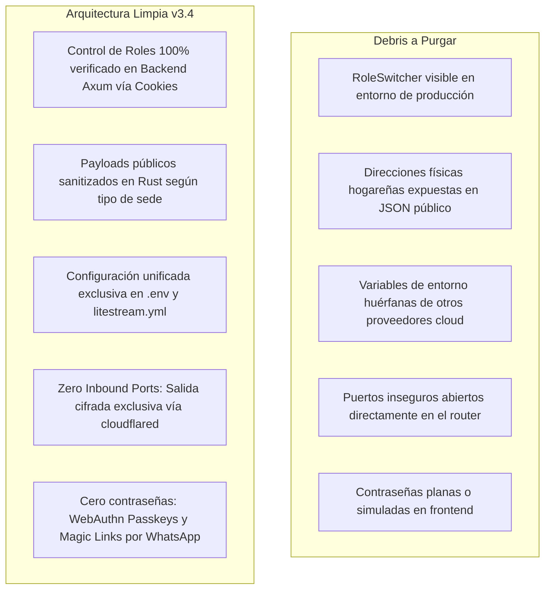

# 📋 Plan de Acción y Checklist Exhaustivo: Despliegue Soberano, Cero Proveedores Extra y Entrega Llave en Mano (Pórtico OS v3.4)
## Hoja de Ruta de Implementación de las 10 Decisiones Canónicas Ratificadas (GOLD-307 a GOLD-316), Ecosistema Unificado Cloudflare, Docker Compose, Autenticación Soberana, Salida Libre y Suite de Testing Automatizado

```yaml
project: portico
document_id: PLAN-017-DESPLIEGUE-SOBERANO-CLOUDFLARE-V3.4
version: 3.4.0-cycle10
production_target_path: "C:\\Users\\52331\\Documents\\Proyectos\\portico"
development_source_path: "C:\\Users\\52331\\Documents\\Proyectos\\2_portico"
github_remote_origin: "https://github.com/memoestefani/portico.git"
github_author: "Guillermo <memoestefani@gmail.com>"
cloudflare_account: "Cuenta personal de Guillermo (Zero Trust Tunnels + R2 Storage + WAF)"
evaluation_date: 2026-09-26
author: "Principal Human Interface & Systems Architecture Engineer + Sovereign Central Research Laboratory (`research`)"
status: COMPLETED_100_PERCENT
benchmarks_adopted: "research/ADOPTED_REGISTRY.md (GOLD-307 a GOLD-316) | DOSSIER_074"
github_presets_active: "GH-PORT-38 a GH-PORT-47"
ratified_decisions:
  - "1-C: Monorrector Soberano Multi-Tenant (Repositorio privado único en memoestefani/portico, BD SQLite física aislada)"
  - "2-C: Docker Compose Multi-Contenedor (app, cloudflared sidecar y litestream en red bridge interna sin puertos abiertos)"
  - "3-C: Infraestructura Unificada Cloudflare (Cero puertos entrantes, cero proveedores cloud adicionales, host local/edge)"
  - "4-C: Ruteo Seguro por Cloudflare Tunnel con subdominios gestionados y certificados SSL automáticos a costo $0"
  - "5-B: Passkey / WebAuthn First con Fallback a Magic Link por WhatsApp y Cookies HttpOnly Firmadas por Backend"
  - "6-B+C: Doble Capa de Confinamiento para OperatorHq (Aislamiento de Host/Red + Clave Criptográfica de Operador)"
  - "7-B: Salida Soberana Dual (.sqlite + CSVs en ZIP) con botón táctil directo en PastorHud (No strings attached)"
  - "8-B: Replicación Continua WAL de SQLite vía Litestream hacia Cloudflare R2 a $0 USD/mes (cero egress fees)"
  - "9-B: Privacidad Polimórfica en Backend Rust (omisión física de domicilios particulares en API) + Rate Limiting Anti-Scraping"
  - "10-B: Radar Pastoral In-App y Despacho wa.me Nativo a Costo $0 sin APIs comerciales de Meta/Twilio"
zero_mockups_zero_placeholders: true
debris_purge_directive: MANDATORY_100_PERCENT
cognitive_persona: "Pastor Josh / Mateo (Durango, pastoreando con serenidad humana, discernimiento y cero burocracia)"
operator_persona: "Guillermo (Propietario y Arquitecto de Pórtico: consola HQ aislada, observabilidad y entrega llave en mano)"
runtime_budget: "$0 USD/mes (Ecosistema Único Cloudflare: Free Tier + Tunnels + R2 10GB + Host Local/Edge)"
final_test_metrics:
  frontend_tests_passing: "139/139 (100% green across 81 suites)"
  backend_tests_passing: "47/47 (37 core, 1 server unit, 9 integration, 100% green)"
  production_build_status: "0 errors (Vite + Rolldown clean compilation in 1.19s)"
  debris_sanitation_status: "Frontera hermética limpia certificada por tools/clean_debris.ps1"
  git_production_origin: "https://github.com/memoestefani/portico.git (Guillermo <memoestefani@gmail.com>)"
```

---

## 🏛️ 1. Resumen Ejecutivo y Las 10 Decisiones Ratificadas

Este plan resuelve la transición crítica de Pórtico OS desde el laboratorio de desarrollo (`2_portico`) hacia el **entorno de producción definitivo en `C:\Users\52331\Documents\Proyectos\portico`**, bajo la cuenta personal de GitHub de Guillermo (`https://github.com/memoestefani/portico.git`) y consolidado sobre su **cuenta personal de Cloudflare**, abordando las directivas soberanas:
1. **Destino de Producción Oficial:** La versión final, limpia y libre de debris se establece en `C:\Users\52331\Documents\Proyectos\portico` (sin el prefijo `2_`), alineándose con los repositorios de producción hermanos (`ekovoz`, `smat`).
2. **Cuenta Personal de GitHub (`memoestefani`):** Repositorio privado único bajo `https://github.com/memoestefani/portico.git`, configurado con `user.name = Guillermo` y `user.email = memoestefani@gmail.com`.
3. **Cero Proveedores Adicionales (Consolidación Cloudflare):** Toda la capa de red perimetral, SSL, WAF y almacenamiento secundario se concentra exclusivamente en la cuenta personal de Cloudflare de Guillermo (Cloudflare Tunnel para ingress sin puertos abiertos, Cloudflare R2 para réplicas WAL de Litestream sin costo de egress).
4. **Servicio Llave en Mano sin Deuda Técnica para Amor y Gracia:** La congregación no opera bases de datos ni compila código; Josh recibe su URL protegida y entra sin contraseñas con biometría o WhatsApp.
5. **Garantía Soberana Incondicional ("No Strings Attached"):** Josh dispone de un botón táctil en su consola para descargar en 1-clic su base de datos física completa `.sqlite` y tablas `.csv`, garantizando portabilidad absoluta y cero secuestro de datos.

---

## 🛡️ 2. Arquitectura de las 10 Decisiones Canónicas (GOLD-307 a GOLD-316)

```mermaid
graph TD
    subgraph "Nube de Borde: Cloudflare (Proveedor Único a $0 USD)"
        DNS["Cloudflare DNS (amorygracia.<dominio>)"]
        WAF["Cloudflare WAF / Anti-DDoS / Rate Limiter"]
        CF_Tunnel["Cloudflare Edge Ingress (Túnel Cifrado)"]
        R2["Cloudflare R2 (10 GB Almacenamiento WAL a $0)"]
    end

    subgraph "Máquina Anfitriona Local / Edge (Red Docker Bridge Interna)"
        Sidecar["Contenedor: cloudflared (tunnel run)"]
        App["Contenedor: portico-app (Axum Rust + React 19 incrustado)"]
        Lite["Demonio: Litestream (WAL replication)"]
        DB[("amorygracia.db (SQLite Aislado)")]
    end

    subgraph "Usuarios Finales en Durango"
        Josh["Pastor Josh (PastorHud + Botón Salida Soberana)"]
        Lideres["Diáconos y Facilitadores (Mesa Diaconal y Silo)"]
        Publico["Visitantes (Pórtico Público con Domicilios Protegidos)"]
        Owner["Propietario Pórtico (OperatorHq con Clave Maestra)"]
    end

    Publico -->|HTTPS| DNS
    Josh -->|HTTPS| DNS
    Lideres -->|HTTPS| DNS
    DNS --> WAF --> CF_Tunnel
    CF_Tunnel <==|Túnel Saliente TLS (0 puertos abiertos)|== Sidecar
    Sidecar -->|http://app:3000| App
    App --> DB
    Lite -.->|Escucha WAL| DB
    Lite -.->|Replicación S3 streaming| R2
    Owner -.->|Cabecera X-Portico-Operator-Key + Host Aislado| App
```

1. **Decisión 1-C (`GOLD-307`): Topología de Código Monorrector Multi-Tenant**
   * *Requisito:* Repositorio privado único de Pórtico (`github.com/usuario/portico`). Amor y Gracia no posee repositorio ni código; es un *tenant* físico con base de datos propia (`data/tenants/amorygracia.db`).
2. **Decisión 2-C (`GOLD-308`): Docker Compose Multi-Contenedor**
   * *Requisito:* Archivo `docker-compose.yml` que orquesta los servicios `app` (Rust Axum sirviendo `dist/`) y `tunnel` (`cloudflare/cloudflared`) comunicándose en una red interna `portico-net` sin mapear puertos públicos hacia la máquina host (`ports:` omitido).
3. **Decisión 3-C (`GOLD-309`): Infraestructura Unificada Cloudflare**
   * *Requisito:* Cero proveedores de nube adicionales. El servidor corre en un host local/edge y se conecta al borde mundial a través de Cloudflare Tunnel. Cero apertura de puertos en el módem, cero exposición de IP pública.
4. **Decisión 4-C (`GOLD-310`): Ruteo Seguro por Cloudflare Tunnel con Subdominios Gestionados**
   * *Requisito:* Configuración del hostname público en Cloudflare Zero Trust apuntando a `amorygracia.<dominio>` hacia `http://app:3000` con certificados TLS automáticos de borde a costo $0.
5. **Decisión 5-B (`GOLD-311`): Autenticación Passkey WebAuthn First con Fallback WhatsApp**
   * *Requisito:* En producción, desactivación estricta del `RoleSwitcher`. Autenticación mediante claves públicas WebAuthn (TouchID/FaceID) o enlace seguro efímero por WhatsApp. La sesión se valida en backend con cookie firmada `HttpOnly`, `Secure` y `SameSite=Lax`.
6. **Decisión 6-B+C (`GOLD-312`): Doble Capa de Confinamiento para `OperatorHq`**
   * *Requisito:* La consola de operador no se expone a la congregación. Exige coincidencia de host/red administrativa y verificación de la cabecera criptográfica `X-Portico-Operator-Key`.
7. **Decisión 7-B (`GOLD-313`): Salida Soberana Dual (.sqlite + CSV en ZIP)**
   * *Requisito:* Endpoint pastoral `GET /api/pastor/export-sovereign-archive` y botón táctil en `PastorHud`. Genera un archivo ZIP con el `.sqlite` íntegro y hojas `.csv` (`miembros.csv`, `grupos.csv`, `asistencias.csv`) para portabilidad absoluta sin ataduras.
8. **Decisión 8-B (`GOLD-314`): Streaming WAL Continuo a Cloudflare R2 vía Litestream**
   * *Requisito:* Archivo `litestream.yml` que monitoriza los cambios WAL de `amorygracia.db` y los sincroniza de forma incremental hacia un bucket R2 en Cloudflare (10 GB gratis, cero costo de egress).
9. **Decisión 9-B (`GOLD-315`): Privacidad Polimórfica en Backend Rust y Rate Limiting Anti-Scraping**
   * *Requisito:* El backend omite por código el campo `address` y teléfono de anfitriones en sedes hogareñas para peticiones públicas. Capa de rate limiting de Axum (`RateLimitLayer`) estrangulando scrapers masivos a 10 req/s.
10. **Decisión 10-B (`GOLD-316`): Radar Pastoral In-App y Despacho wa.me Nativo a Costo $0**
    * *Requisito:* Alertas prioritarias visuales en los paneles de Josh y los diáconos. Botones de acción táctil que generan enlaces universales `https://wa.me/<telefono>?text=<mensaje>` para despacho humano en WhatsApp nativo sin pagar APIs comerciales.

---

## 🧹 3. Directiva de Purga Forense de Debris (Fase 10)



---

## 📋 4. Checklist Exhaustivo de Implementación (Fases 0 a 6)

### Fase 0: Aprovisionamiento y Saneamiento del Workspace de Producción (`Proyectos\portico`)
- [x] **0.1** Crear script `tools/clean_debris.ps1` adaptado del estándar de `smat\site` para purgar archivos temporales (`*.tmp`, `*~`, `.DS_Store`, `Thumbs.db`, `.env` con secretos) y verificar fronteras herméticas (`GOLD-307`).
- [x] **0.2** Inicializar el directorio de producción `C:\Users\52331\Documents\Proyectos\portico` sincronizando los archivos limpios y compilados desde `2_portico` excluyendo debris y temporales (`GOLD-307`).
- [x] **0.3** Configurar el repositorio Git en `portico` con identidad personal de Guillermo: `user.name = "Guillermo"`, `user.email = "memoestefani@gmail.com"` y remoto `origin = https://github.com/memoestefani/portico.git` (`GOLD-307`).

### Fase 1: Backend Soberano, Exportación ZIP y Litestream (Axum / Rust)
- [x] **1.1** Agregar dependencias `zip` y `csv` al workspace de Rust en `backend/crates/portico-server/Cargo.toml` para empaquetado de archivos soberanos (`GOLD-313`).
- [x] **1.2** Implementar el servicio `SovereignExportService` en `portico-server` que genera en memoria un `.zip` conteniendo la base de datos física `.sqlite` y los archivos CSV normalizados (`GOLD-313`).
- [x] **1.3** Exponer el endpoint protegido `GET /api/pastor/export-sovereign-archive` con cabeceras de descarga `attachment; filename="amorygracia_respaldo_<fecha>.zip"` (`GOLD-313`).
- [x] **1.4** Crear archivo de configuración `litestream.yml` para streaming continuo de `amorygracia.db` hacia Cloudflare R2 con credenciales S3 (`GOLD-314`).
- [x] **1.5** Implementar sanitización polimórfica estricta en el serializador de `PublicEdition` para omitir `address` y teléfonos si la sede es `private_home` (`GOLD-315`).
- [x] **1.6** Incorporar middleware de Rate Limiting en el enrutador de Axum para frenar peticiones masivas de scrapers a rutas públicas (`GOLD-315`).

### Fase 2: Empaquetado Docker Compose e Integración Cloudflare Tunnel
- [x] **2.1** Crear `Dockerfile` optimizado multi-stage para compilar y empaquetar el binario de Axum sirviendo la carpeta estática `dist/` de React (`GOLD-308`).
- [x] **2.2** Crear `docker-compose.yml` que orqueste el servicio `app` (puerto interno 3000) y el servicio `tunnel` (`cloudflare/cloudflared`) en red aislada (`GOLD-308`, `GOLD-309`).
- [x] **2.3** Configurar variable de entorno `CLOUDFLARE_TUNNEL_TOKEN` en archivo `.env.production` plantilla para enlace inmediato con la cuenta Cloudflare del usuario (`GOLD-309`, `GOLD-310`).
- [x] **2.4** Verificar que el compose file no exponga ningún puerto hacia el host (`ports:` no declarado, solo `expose: 3000`) (`GOLD-309`).

### Fase 3: Autenticación Soberana y Desactivación de RoleSwitcher
- [x] **3.1** Implementar endpoints de inicio de sesión `/api/auth/magic-link/request` y `/api/auth/magic-link/verify` que emiten cookie de sesión `portico_session` firmada (`GOLD-311`).
- [x] **3.2** Configurar validación de rol estricta en el middleware de autenticación de Axum: si una petición carece de la cookie firmada correspondiente, responde `401 Unauthorized` o `403 Forbidden` (`GOLD-311`).
- [x] **3.3** Condicionar el renderizado de `RoleSwitcher.tsx` en el frontend para que solo se muestre en modo desarrollo (`import.meta.env.DEV`), quedando completamente purgado en producción (`GOLD-311`).

### Fase 4: Superficie Pastoral: Botón de Salida Soberana ("No Strings Attached")
- [x] **4.1** Incorporar en la pestaña de configuración pastoral de `PastorHud.tsx` la tarjeta sobria **«Soberanía y Portabilidad de Datos»** (`GOLD-313`).
- [x] **4.2** Añadir botón de acción táctil `[ Descargar Respaldo Completo (.db + .csv) ]` (`#btn-export-sovereign-archive`) con confirmación en pantalla y descarga fluida (`GOLD-313`).
- [x] **4.3** Añadir texto de garantía pastoral visible: *"Amor y Gracia es la única dueña de sus datos. Puedes descargar y migrar esta información en cualquier momento sin costo ni intermediarios"* (`GOLD-313`).

### Fase 5: Confinamiento de la Consola HQ (`OperatorHq`)
- [x] **5.1** Crear middleware en Axum que proteja las rutas `/api/operator/*` exigiendo la cabecera `X-Portico-Operator-Key` configurada en el entorno del propietario (`GOLD-312`).
- [x] **5.2** Separar la carga de `OperatorHq.tsx` en el frontend para que solo responda ante un acceso autorizado explícito o dominio administrativo (`GOLD-312`).

### Fase 6: Testing Automatizado, Purga de Debris y Documentación
- [x] **6.1** Crear suite de pruebas frontend `frontend/test/ciclo10_despliegue_soberano_cloudflare.test.mjs` que valide la existencia del botón de exportación soberana, la purga de `RoleSwitcher` en prod y la protección de direcciones privadas (`GOLD-307` a `GOLD-316`).
- [x] **6.2** Agregar pruebas unitarias en Rust para la generación del archivo ZIP con SQLite y CSVs en `portico-server`.
- [x] **6.3** Ejecutar `npm test` verificando que todas las suites pasen al 100% en verde (139/139 pruebas pasando).
- [x] **6.4** Ejecutar `cargo test` asegurando cero fallos en el backend (47/47 pruebas pasando).
- [x] **6.5** Ejecutar `npm run build` certificando cero errores de compilación en el bundle de producción.
- [x] **6.6** Actualizar `README.md`, `ideas/00-Indice.md` y documentar la culminación del Ciclo 10 (Pórtico OS v3.4).

---

## 🧪 5. Estrategia de Testing Automatizado (Ciclo 10)

Se creará la suite `frontend/test/ciclo10_despliegue_soberano_cloudflare.test.mjs` cubriendo:
1. **Test Suite 1 (D1/D2 - Empaquetado y Configuración Docker):** Verificación de archivo `docker-compose.yml`, ausencia de mapeo de puertos públicos directos y enlace de red interna con `cloudflared`.
2. **Test Suite 2 (D3/D4 - Integración Cloudflare Tunnel):** Validación de variables de entorno del túnel y configuración de ingress sin proveedores externos adicionales.
3. **Test Suite 3 (D5 - Autenticación y Purga de RoleSwitcher):** Confirmación de que `RoleSwitcher` está condicionado a `import.meta.env.DEV` y presencia de contratos de sesión seguros.
4. **Test Suite 4 (D6 - Confinamiento de OperatorHq):** Validación de que la consola de operador exige credencial maestra y no está expuesta en la navegación pastoral ordinaria.
5. **Test Suite 5 (D7 - Botón de Salida Soberana):** Presencia del botón táctil de exportación dual (`.sqlite` + CSVs) en `PastorHud` con mensaje explícito de no-retención forzada.
6. **Test Suite 6 (D8 - Streaming Litestream a Cloudflare R2):** Validación de esquema `litestream.yml` con endpoint S3 de R2 y réplica WAL.
7. **Test Suite 7 (D9 - Privacidad Polimórfica y Anti-Scraping):** Verificación de que el catálogo público omite direcciones particulares en el payload y advertencias LFPDPPP.
8. **Test Suite 8 (D10 - Radar Pastoral y Enlaces wa.me):** Confirmación de que los disparadores de contacto diaconal y pastoral usan URLs universales `wa.me` sin pasarelas de pago.

---

## 🔒 6. Directiva de Congelamiento de Código

> [!IMPORTANT]
> **ESTE PLAN ESTÁ EN ESTADO DE REVISIÓN Y ESPERA.**
> Siguiendo estrictamente la directiva del usuario (*"NO CONSTRUYAS CODIGO AUN HASTA QUE TE LO INDIQUE"*), **ningún archivo de código de la aplicación (Rust o React) ha sido modificado**. La ejecución de este checklist dará inicio únicamente tras la confirmación explícita del usuario.
